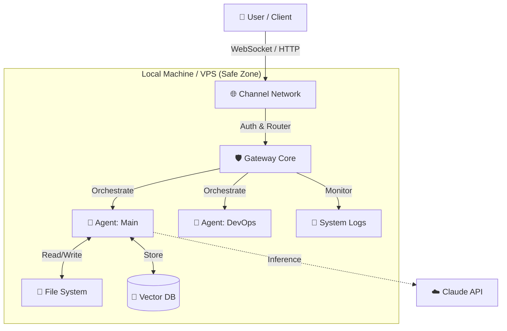
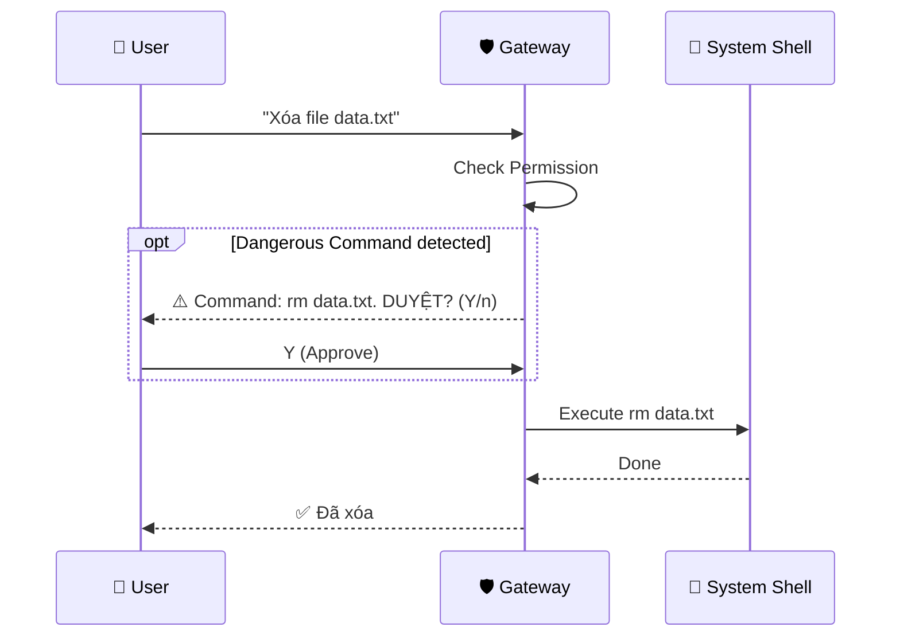

import Tabs from '@theme/Tabs';
import TabItem from '@theme/TabItem';
import Admonition from '@theme/Admonition';

# 🏗️ Kiến trúc hệ thống

Khám phá cách Moltbot vận hành "under the hood" - từ **Gateway** trung tâm đến các **AI Agents** độc lập.

## 🗺️ Tổng quan (High-Level)

Moltbot hoạt động theo mô hình **Local-First Architecture**. Mọi xử lý logic, lưu trữ dữ liệu và thực thi lệnh đều diễn ra trên máy của bạn (hoặc server của bạn), không phụ thuộc vào cloud server của bên thứ 3 (ngoại trừ LLM API).

---

## 🧩 Các thành phần cốt lõi

<Tabs groupId="architecture-components" className="unique-tabs-look">
  <TabItem value="gateway" label="🛡️ Gateway (The Kernel)" default>
    

      

        <h3>Bộ não trung tâm</h3>
        
Gateway là một process **Node.js** chạy daemon (ngầm) 24/7. Nó đóng vai trò như hệ điều hành của Bot.

        <ul>
          <li><strong>🔌 Connectivity:</strong> Quản lý WebSocket Server (port 18789).</li>
          <li><strong>🚦 Routing:</strong> Điều phối tin nhắn từ Client đến đúng Agent.</li>
          <li><strong>💾 Persistence:</strong> Tự động lưu trữ chat history vào SQLite/PostgreSQL.</li>
          <li><strong>🔐 Security:</strong> Kiểm soát Permissions và Sandbox rules.</li>
        </ul>
      

      

        <Admonition type="info" title="Technical Specs">
          
<strong>Protocol:</strong> WebSocket + HTTP REST

          
<strong>DB:</strong> Better-SQLite3 (Default)

          
<strong>Process:</strong> Single-threaded Event Loop

        </Admonition>
      

    

  </TabItem>
  
  <TabItem value="agents" label="🤖 Agents (Workers)">
    <h3>Nhân lực kỹ thuật số</h3>
    
Mỗi Agent là một thực thể độc lập với cấu hình riêng:

    
    

      

        

          

            <h4>🧠 Memory Context</h4>
            
Mỗi agent có vector store riêng, không nhớ nhầm context của agent khác.

          

        

      

      

        

          

            <h4>🛠️ Toolset</h4>
            
Agent "Dev" có tool Terminal, trong khi Agent "Sale" chỉ có tool Email.

          

        

      

      

        

          

            <h4>📂 Workspace</h4>
            
Mỗi agent hoạt động trong 1 thư mục root (cwd) cụ thể.

          

        

      

    

  </TabItem>
  
  <TabItem value="clients" label="📱 Clients">
    
Giao diện để con người tương tác với Moltbot:

    <ul>
      <li><strong>CLI (`moltbot chat`):</strong> Cho developer, tương tác trực tiếp qua pipe.</li>
      <li><strong>Web Dashboard:</strong> Quản lý admin, xem logs, settings.</li>
      <li><strong>Channel Adapters:</strong> Connectors cho Telegram, Discord, Zalo... biến các nền tảng chat này thành Client.</li>
    </ul>
  </TabItem>
</Tabs>

---

## 🔄 Data Flow: Một tin nhắn đi đâu?

Hành trình của tin nhắn *"Hello Moltbot"* từ lúc bạn gửi đến khi nhận phản hồi:

  
  ### 1. Reception (Tiếp nhận)
  <Admonition type="secondary">
    Channel Adapter (ví dụ Telegram Bot) nhận webhook từ Server Telegram -> Chuyển thành internal JSON format -> Gửi vào **Gateway WebSocket**.
  </Admonition>

  ### 2. Processing (Xử lý)
  <Admonition type="secondary">
    **Gateway** xác thực User ID -> Router check xem User đang nói chuyện với Agent nào -> Forward payload tới **Active Agent**.
  </Admonition>

  ### 3. Cognition (Suy nghĩ)
  <Admonition type="secondary">
    **Agent** thực hiện RAG (Retrieval Augmented Generation):
    1. Lục lại Vector DB (Ký ức cũ).
    2. Gom context hiện tại.
    3. Gửi prompt + context lên **Claude API**.
  </Admonition>

  ### 4. Action & Response (Hành động)
  <Admonition type="secondary">
    Nếu cần hành động (ví dụ: Chạy lệnh), Agent sẽ yêu cầu **Gateway** thực thi (cần User Approval nếu nhạy cảm).
    Cuối cùng, câu trả lời (Text) được gửi ngược dòng: Agent -> Gateway -> Telegram -> **User**.
  </Admonition>

---

## 🔒 Security Model: "Pairing"

Tại sao Moltbot an toàn hơn các giải pháp khác?

<Admonition type="tip" title="Human-in-the-loop">
  Moltbot không bao giờ tự ý thực hiện các lệnh nguy hiểm (như delete file, upload data) mà không hỏi ý kiến bạn trước (trừ khi bạn cấu hình "Auto-Approve" cho safe commands).
</Admonition>
